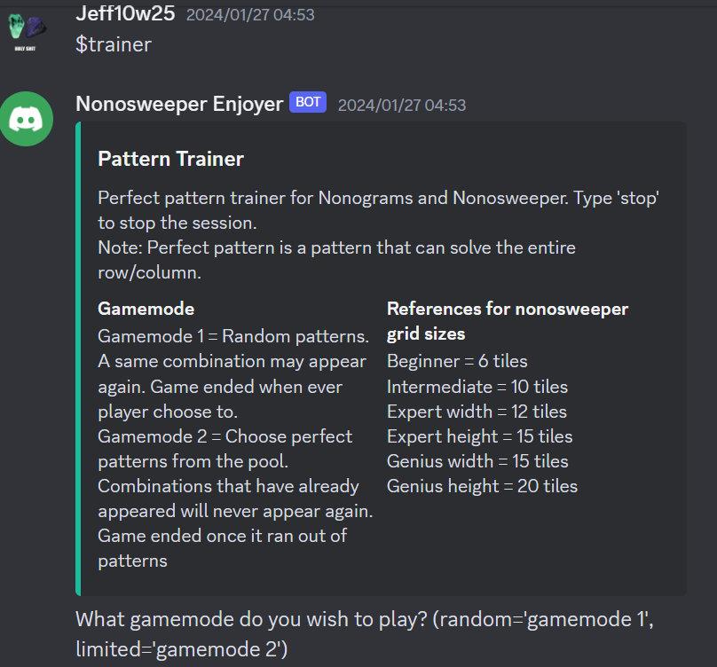
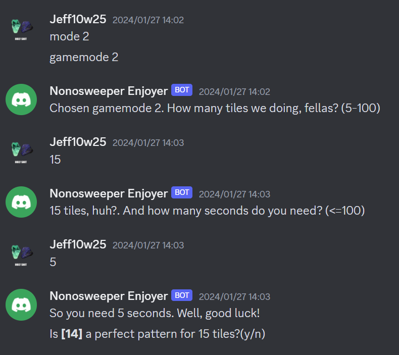
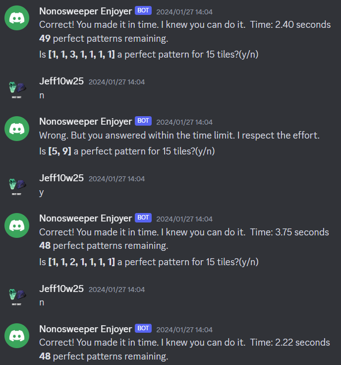

# NonoTrainer Bot

This repository contains scripts to Nonosweeper Enjoyer discord bot which its function is based on puzzle game Nonogram and Nonosweeper.

### Purpose

To train player's pattern recognition by playing mini-game with players and showing lists of perfect patterns.

### About me

I am a Nonosweeper player with a personal bests of 1.686+15.667+51.56+153.698 = 222.611. My account id is 77227 or known as Hoshino on [League of Minesweeper](https://www.taptap.cn/app/138188). 

This is still a work in progress. I plan on optimizing my code and adding more functions.

### Demo

Currently there are 3 commands which are:

- $help
- $pattern
- $trainer

Access the bot by typing these commands. For example, typing $trainer command should give results below.

Mode selection. Here, we selected gamemode 2.

Gameplay of Trainer gamemode 2

# What are Nonosweeper and Nonogram?

Nonogram: https://en.wikipedia.org/wiki/Nonogram

Nonosweeper: https://www.nonosweeper.com/

# What are perfect patterns?

Perfect patterns are patterns that can solve entire row/column in one go. Add more details later

